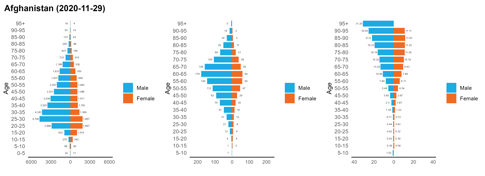

# COVerAge_Plot : Age Pyramid for the COVerAGE-DB Dataset
COVerAGE-DB dataset: [https://github.com/timriffe/covid_age](https://github.com/timriffe/covid_age)

- [Country-specific plot](https://github.com/liuyanguu/COVerAge_Plot/blob/master/README.md#country-specific-plot)
- [Aggregated plots for all countries](https://github.com/liuyanguu/COVerAge_Plot/blob/master/README.md#aggregated-plots-for-all-countries)
- [All the plots](https://github.com/liuyanguu/COVerAge_Plot/blob/master/README.md#all-together-aggregated--country-specific)

The `main_script.R` walks through the process to make all the plots below (updated on 2020-09-10)

## Download raw data from OSF: https://osf.io/mpwjq/
```{r}
source("plotting_funcs.R") # all the plotting functions
source("00_Functions_convert_to_count.R") # borrow to distribute total if Metric is "Fraction"
inputDB <- refresh_data() # re-download and calculate fraction into numbers 
```

## Country-specific plot 
* Age pyramid for each country showing Cases, Deaths, and CFR (Death/Case), whichever is available
* Showing sex-specific if available
* Showing in title the latest date used as it is different for each country
```{r}
dt1 <- clean_inputDB(inputDB = inputDB)
all_countries <- get_cnames(dt1)
cname0 <- all_countries[1]
p1 <- make_country_plot(cname0)
```



## Aggregated plots for all countries 
* Only choose those with both case and death data with matching age intervals, thus can calculate CFR
* By assigning a common age interval, only those countries whose age interval are adaptable are used (i.e. through combining intervals into a wider one, 0-5 & 5-10 -> 0-10) 
* Fewer countries will be included if set a stricter/narrower interval, or set `get_f_m = TRUE` to ask for sex-specific data
```{r}
# this example shows the countries available with 0 to 60 by 10 years age intervals
data_total1 <- rbindlist(lapply(all_countries, get_dt_for_total, 
                                data = dt1,
                                target_interval = seq(0, 60, by = 10),
                                get_f_m = TRUE))
# a three-panel plot (Case, Death, CFR) for a specific given interval
g1 <- plot_aggregated_total(data_total1)
```
* A wrapped function to plot and save the aggregated plot:  
Return list of figures, and save output using ggsave in the same time   
```{r}
g_list <- plot_aggregated_total_wrap(
  data = dt1, 
  max_interval = 60, 
  by_interval = 10,
  one_row = FALSE, # 2 rows if FALSE, 1st row is total, 2nd row is sex-specific
  folder = "fig/aggregated")

# Make and save different combinations of desired intervals
g_total <- Map(plot_aggregated_total_wrap, 
               max_interval = c(60, 60, 80, 80), by_interval = c(10, 20, 10, 20),
               one_row = FALSE)
```


## All together (aggregated + country-specific)
Please refer to the code in `main_script.R`

### Aggregated results using different combinations  


### Every country in the dataset  

